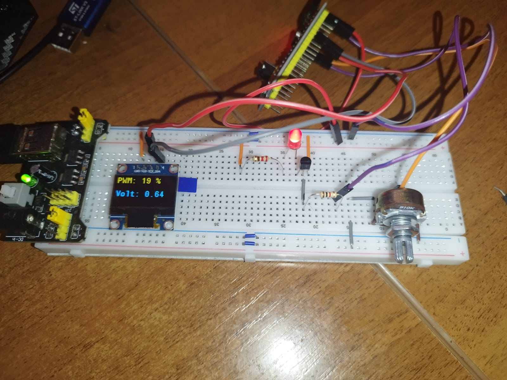

# STM32F103 ADC OLED PWM Controller

## Overview

This project demonstrates a complete real-time embedded control system based on the STM32F103C8T6 microcontroller.

The system acquires an analog voltage from a potentiometer using ADC and DMA, processes the signal in real time, displays measurements on an SSD1306 OLED display, and controls LED brightness using PWM through an NPN transistor driver stage.

### Prototype



---

## Features

- ADC acquisition using DMA Circular Mode
- Timer-triggered sampling using TIM3
- Half-buffer and Full-buffer DMA processing
- Real-time voltage computation
- PWM generation using TIM2
- SSD1306 OLED display via I²C
- Analog anti-noise filtering (100 nF)
- External transistor driver stage
- KiCad schematic design

---

## Hardware Components

| Component | Description |
|------------|------------|
| STM32F103C8T6 | Main MCU |
| SSD1306 | OLED Display |
| Potentiometer 10kΩ | Analog Input |
| NPN Transistor | LED Driver |
| Red LED | PWM Output |
| 100 nF Capacitor | Analog Filtering |

---

## System Architecture

```text
TIM3
 ↓
ADC1
 ↓
DMA Circular Buffer
 ↓
Half Complete Callback
 ↓
Full Complete Callback
 ↓
Voltage Processing
 ↓
TIM2 PWM
 ↓
NPN Transistor
 ↓
LED

SSD1306 OLED Display


## Author

**Rey Pirse**

Electronics Engineer | Embedded Systems Developer
